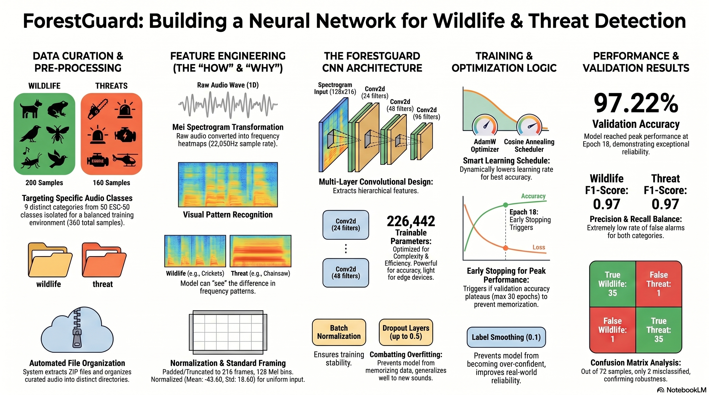

# 🌲 ForestGuard — Neural Network for Wildlife & Threat Detection

<p align="center">
  
</p>

ForestGuard is a deep learning-based audio classification system built with **PyTorch** that distinguishes urban sound threats (e.g., chainsaws, sirens, engine idling) from natural wildlife audio (e.g., crickets, birdsong, frogs). The system is designed to support forest monitoring and conservation efforts by enabling automated acoustic surveillance.

---

## 📊 Performance Summary

| Metric | Value |
|---|---|
| **Best Validation Accuracy** | **97.22%** |
| **Wildlife F1-Score** | 0.97 |
| **Threat F1-Score** | 0.97 |
| **Trainable Parameters** | 226,442 |
| **Early Stopping Epoch** | 18 (of 30 max) |

The confusion matrix on the validation set shows only **2 misclassifications** out of 72 samples, confirming strong generalization.

---

## 🗂️ Project Structure

```
forestguard/
├── forest.ipynb                 # Main notebook — full end-to-end pipeline
├── Neural_Network_Wildlife_Threat_Detection.png  # Architecture diagram
├── .gitattributes               # Git LFS tracking rules
├── README.md                    # This file
│
├── dataset/
│   ├── raw/                     # Raw ESC-50 zip archive (Git LFS tracked)
│   │   └── environmental-sound-classification-50.zip
│   ├── audio/                   # Extracted ESC-50 .wav files
│   ├── curated/                 # Curated audio samples split by class
│   │   ├── wildlife/            # Wildlife audio clips
│   │   └── threat/              # Threat audio clips
│   ├── processed/               # Pre-processed NumPy arrays (Git LFS tracked)
│   │   ├── X_train.npy          # Training features (mel spectrograms)
│   │   ├── X_val.npy            # Validation features
│   │   ├── y_train.npy          # Training labels
│   │   ├── y_val.npy            # Validation labels
│   │   └── norm_stats.npz       # Mean & std for normalization
│   ├── esc50.csv                # ESC-50 metadata file
│   ├── bc_utils.py              # Low-level audio utilities (ffmpeg wrappers, mixing, augmentation)
│   ├── utils.py                 # ESC50 data generator with multiprocessing support
│   └── utils2.py                # Alternative Keras Sequence-based data generator
│
└── models/
    ├── forestguard_cnn.pt       # Trained PyTorch model weights (state_dict)
    ├── label_map.json           # Label mapping: {"0": "Wildlife", "1": "Threat"}
    └── norm_stats.npz           # Normalization statistics (mean & std)
```

---

## 🧠 Model Architecture

The ForestGuard CNN is a multi-layer convolutional neural network that operates on mel spectrogram inputs of shape **(1, 128, 216)** — 1 channel, 128 mel bins, and 216 time frames.

**Architecture Summary:**

| Layer | Type | Details |
|---|---|---|
| Conv Block 1 | Conv2d → BatchNorm → ReLU → MaxPool → Dropout | 24 filters, 3×3 kernel |
| Conv Block 2 | Conv2d → BatchNorm → ReLU → MaxPool → Dropout | 48 filters, 3×3 kernel |
| Conv Block 3 | Conv2d → BatchNorm → ReLU → MaxPool → Dropout | 96 filters, 3×3 kernel |
| Flatten | — | — |
| FC1 | Linear → ReLU → Dropout(0.5) | 128 units |
| FC2 | Linear | 2 units (output classes) |

**Training Configuration:**

| Parameter | Value |
|---|---|
| Optimizer | AdamW (lr=5e-4, weight_decay=5e-3) |
| Loss Function | CrossEntropyLoss (label_smoothing=0.1) |
| LR Scheduler | CosineAnnealingLR (T_max=25, eta_min=1e-6) |
| Batch Size | 16 |
| Max Epochs | 30 |
| Early Stopping Patience | 6 |

---

## 🔬 Data Pipeline

### Source Dataset
The project uses the **ESC-50** dataset (Environmental Sound Classification) as its raw data source. From the 50 available sound categories, **9 specific classes** are curated into a binary classification task:

- **Wildlife** (Class 0): Natural sounds like crickets, birdsong, frogs, etc. — **200 samples**
- **Threat** (Class 1): Urban/industrial sounds like chainsaws, sirens, engine idling, etc. — **160 samples**

### Feature Engineering
1. **Audio Resampling**: Raw audio is resampled to **22,050 Hz** using `ffmpeg` (via `bc_utils.py`)
2. **Mel Spectrogram Extraction**: Audio is converted to mel spectrograms with **128 mel bins**
3. **Frame Standardization**: Spectrograms are padded/truncated to **216 time frames**
4. **Normalization**: Global mean (-43.60) and std (18.60) normalization is applied
5. **Train/Val Split**: 80/20 split — 288 training samples, 72 validation samples

### Data Augmentation
The utility scripts (`utils.py`, `utils2.py`, `bc_utils.py`) support:
- Random cropping
- Gain augmentation
- Audio mixing (blending signals)
- Multiprocessing-based data generation

---

## ⚙️ Environment Setup

### Prerequisites

| Requirement | Details |
|---|---|
| **Python** | 3.10+ recommended |
| **ffmpeg** | Required for audio resampling in `bc_utils.py`. Must be accessible in system PATH. |
| **Git LFS** | Required for cloning large files (model weights, processed data, raw zip archives). |

### Installation

1. **Clone the repository:**
   ```bash
   git lfs install
   git clone https://github.com/<your-username>/forestguard.git
   cd forestguard
   ```

2. **Create and activate a virtual environment:**
   ```bash
   python -m venv .venv
   # On Windows:
   .venv\Scripts\activate
   # On macOS/Linux:
   source .venv/bin/activate
   ```

3. **Install dependencies:**
   ```bash
   pip install torch torchvision torchaudio
   pip install numpy pandas matplotlib seaborn scikit-learn librosa jupyter
   ```

4. **Verify ffmpeg is installed:**
   ```bash
   ffmpeg -version
   ```
   If not installed, download from [ffmpeg.org](https://ffmpeg.org/download.html) and add to your system PATH.

---

## 🚀 Usage

### Training from Scratch

1. Ensure the ESC-50 dataset zip is placed in `dataset/raw/`
2. Open and run `forest.ipynb` sequentially from top to bottom
3. The notebook handles:
   - Data extraction and curation
   - Feature engineering (mel spectrograms)
   - Model definition and training with early stopping
   - Evaluation with classification report and confusion matrix
   - Model artifact export to `models/`

### Using Pre-trained Artifacts

The repository includes pre-trained model weights and normalization statistics for direct inference:

```python
import torch
import numpy as np
import json

# Load model architecture
from forest import ForestGuardCNN  # or define the CNN class

model = ForestGuardCNN()
model.load_state_dict(torch.load("models/forestguard_cnn.pt"))
model.eval()

# Load normalization stats
stats = np.load("models/norm_stats.npz")
mean_val, std_val = stats["mean"], stats["std"]

# Load label map
with open("models/label_map.json", "r") as f:
    label_map = json.load(f)
# label_map: {"0": "Wildlife", "1": "Threat"}
```

---

## 📦 Git LFS Configuration

Large binary files are tracked via Git LFS to keep the repository lightweight. The `.gitattributes` file configures:

```
dataset/processed/*.npy filter=lfs diff=lfs merge=lfs -text
dataset/raw/*.zip filter=lfs diff=lfs merge=lfs -text
```

Ensure Git LFS is installed before cloning:
```bash
git lfs install
```

---

## 🗓️ Future Development

- **Modularize Pipeline**: Refactor the monolithic `forest.ipynb` into modular Python scripts for automated training, evaluation, and deployment.
- **Inference Interface**: Build a lightweight CLI or Gradio/Streamlit web app for real-time audio classification.
- **Environment Automation**: Create a `requirements.txt` or `environment.yml` for streamlined setup.
- **Extended Dataset**: Incorporate additional audio datasets beyond ESC-50 for improved robustness.

---

## 📜 License

This project is for educational and research purposes. Please refer to the [ESC-50 dataset license](https://github.com/karolpiczak/ESC-50) for data usage terms.

---

## 🙏 Acknowledgments

- [ESC-50 Dataset](https://github.com/karolpiczak/ESC-50) by Karol Piczak
- [PyTorch](https://pytorch.org/) deep learning framework
- [librosa](https://librosa.org/) for audio feature extraction
- [ffmpeg](https://ffmpeg.org/) for audio processing
